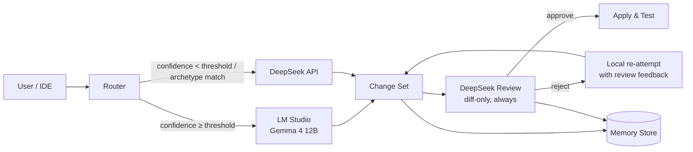
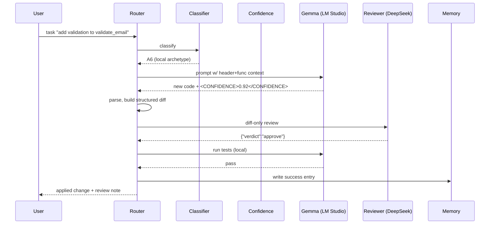
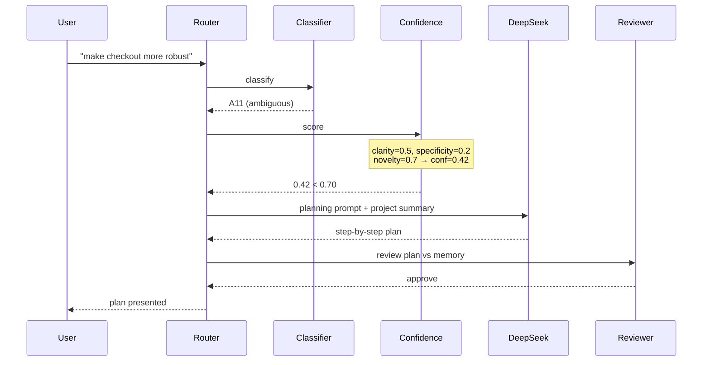
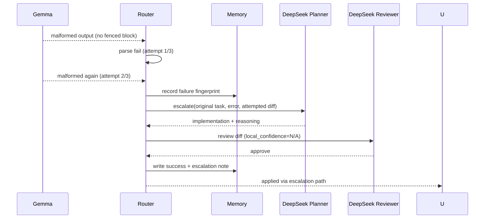

# Hybrid Coding Agent — Gemma 4 12B (Local) + DeepSeek API (Cloud)

## 1. Design Goals & Constraints

| Goal | Target |
|---|---|
| Local task containment | 90–95% of all coding tasks handled by Gemma 4 12B (LM Studio) |
| DeepSeek usage | Only archetype tasks (see §3) + always-on post-edit review |
| API cost | Minimized — send only summaries/diffs, never full file dumps |
| Latency | Local ≤ 1–3s typical; DeepSeek only on slow path |
| Quality | Every code change is reviewed by DeepSeek before acceptance |
| Maintainability | Modular pipeline with clear interfaces (see §10) |

**Why it works:** Gemma 4 12B is strong at well-specified, mechanical, and
localized edits (regenerate a function, fix a lint error, write a test for a
given shape). DeepSeek is strong at open-ended, multi-step, causality-heavy
reasoning. The router exploits this split.

---

## 2. System Overview



- **One entry point** for the user/IDE: the `Router`.
- **One exit point** for the change set: the `DeepSeek Reviewer` (always-on, cheap because diff-only).
- **Memory** is consulted by both the router (routing hints) and the reviewer (regression patterns).

---

## 3. Routing Strategy

### 3.1 Task Archetypes (deterministic pre-classification)

Every request is first classified into an archetype by a cheap **keyword + regex classifier** (no LLM call). Each archetype has a *hard* routing pin:

| # | Archetype | Example | Route |
|---|---|---|---|
| A1 | Project scaffolding / architecture | "Design the module layout for a payment service" | **DeepSeek** |
| A2 | Multi-file refactor with invariants | "Introduce repository pattern across 14 files" | **DeepSeek** |
| A3 | New data model / schema design | "Design the DB schema for multi-tenant billing" | **DeepSeek** |
| A4 | Algorithmic / concurrency / diff-cult reasoning | "Implement lock-free queue with ABA protection" | **DeepSeek** |
| A5 | Bug with open-ended investigation | "Why does this intermittently crash in prod?" | **DeepSeek** |
| A6 | Localized, well-specified edit | "Add validation to `validate_email`" | **Local** |
| A7 | Boilerplate / mechanical generation | "Write a `README.md` template", "Add getters" | **Local** |
| A8 | Test generation for a given signature | "Write tests for `OrderService.checkout`" | **Local** |
| A9 | Lint / type / small compile fix | "Fix the unused import and the mypy error in utils.py" | **Local** |
| A10 | Docstring / comments / formatting | "Add docstrings to module x" | **Local** |
| A11 | Unclear / out-of-vocabulary | anything not matching A1–A10 | Ambiguous → **confidence scoring decides** |

A request may match multiple archetypes. Priority order: **DeepSeek archetypes (A1–A5) beat local archetypes (A6–A10)**. If any A1–A5 keyword matches, route to DeepSeek immediately — this is the *safety ceiling* that keeps quality high regardless of confidence-score tuning.

### 3.2 Keyword / Regex Patterns (startup set)

| Archetype | Pattern (case-insensitive, substring/boundary) |
|---|---|
| A1 | `design`, `architecture`, `scaffold`, `monorepo`, `project structure`, `folder layout` |
| A2 | `refactor`, `migrate`, `repository pattern`, `across \d+ files`, `reorganize` |
| A3 | `schema`, `data model`, `entity relationship`, `migration design`, `database design` |
| A4 | `concurren`, `deadlock`, `lock-free`, `race condition`, `algorithm`, `complexity`, `prove`, `invariant` |
| A5 | `why`, `root cause`, `intermittent`, `debug in prod`, `investigate`, `crash log` |
| A6 | `add validation`, `fix .* function`, `update .* handler`, `change the return type of` |
| A7 | `boilerplate`, `template`, `generate`, `scaffold .* file`, `add getters/setters` |
| A8 | `tests? for`, `unit tests`, `test coverage for` |
| A9 | `lint`, `mypy`, `type error`, `compile error`, `unused import`, `formatting` |
| A10 | `docstring`, `comment`, `README`, `rename variable` |
| A11 | (no match) |

The pattern table lives in `router/archetypes.py` and is easily extended — the agent operator should grow it with observed false routes.

### 3.3 Confidence Scoring (for ambiguous A11 requests)

For requests that reach the A11 path, compute a **confidence score** that the local model can handle the task:

```
confidence = f(task_type, specificity, context_size, history, local_health)
```

```
┌────────────────────────────────────────────────────────────────────────┐
│ score =  w1·clarity      (0–1)                                        │
│        + w2·specificity  (0–1)  # exact file/function/symbol given     │
│        + w3·size_penalty (0–1)  # 1 - min(len(code_input), C)/C        │
│        + w4·history_bonus(0–1)  # similar local tasks succeeded before │
│        - w5·novelty       (0–1)  # never-seen phrase clusters          │
│                                                                        │
│ weights (initial): w1=0.30, w2=0.25, w3=0.15, w4=0.20, w5=0.10        │
│ threshold: LOCAL_THRESHOLD = 0.70                                      │
└────────────────────────────────────────────────────────────────────────┘
```

- **clarity** — estimated from question structure: presence of imperative verb, scoped object, minimal ambiguity words ("maybe", "somehow", "not sure").
- **specificity** — exact file path + line range + symbol reference in the prompt.
- **size_penalty** — penalize huge pasted contexts; local models degrade on enormous windows, and giant prompts also signal a hard task.
- **history_bonus** — nearest-neighbor (embedding or simple token-overlap) against the task memory: if similar tasks were *locally* solved, boost.
- **novelty** — if the request contains term n-grams never seen before in memory, reduce score (unknown territory → cloud).

Decision rule:

```
if any(archetype in DEEPSEEK_ARCHETYPES):           → deepseek
elif any(archetype in LOCAL_ARCHETYPES):            → local
elif confidence >= 0.70:                            → local
else:                                               → deepseek
```

### 3.4 Escalation (local → DeepSeek)

Escalate when any of the following occurs:

1. Local generation fails (timeout, API error, malformed JSON — see §8).
2. Local output fails compile / lint / tests.
3. Reviewer rejects the change (see §6).
4. Local produces an empty or trivial diff after N retries.
5. Local self-reports low confidence (Gemma is prompted to emit a `confidence` field; < 0.6 triggers escalation *before* DeepSeek review).

Escalation message to DeepSeek = **original request + evidence of failure** (error message, failing test output, attempted diff), never the full file.

---

## 4. Prompt Design per Model

### 4.1 System prompts

#### Gemma (local) system prompt

```
You are a precise senior software engineer operating in a local, low-latency
environment. You are given a well-scoped coding task, the relevant file
snippets, and a strict output contract.

Rules:
1. Change ONLY what the task requires. Never restructure unrelated code.
2. Output the complete new version of every modified file in a single
   fenced code block labeled with the file path.
3. If the task is ambiguous, state the ambiguity in <QUESTION> and propose
   the most conservative interpretation; do not guess wildly.
4. End your response with a <CONFIDENCE>0.0–1.0</CONFIDENCE> tag reflecting
   how sure you are the change is correct.
5. Keep changes minimal and idiomatic. Do not add comments explaining obvious code.
```

The `<CONFIDENCE>` tag feeds the escalation rule (3.4.5) and gets stripped before the diff is built.

#### DeepSeek (cloud) system prompt

```
You are the senior architect and final reviewer for a hybrid coding agent.
You are invoked ONLY for (a) high-level planning and architecture, (b) complex
reasoning, or (c) diff-based review of code produced by a local model.

Your review contract:
1. Review the DIFF, not the whole file. Reason about correctness, edge cases,
   concurrency, security, and style.
2. Reply in strict JSON: {"verdict": "approve"|"reject", "issues": [...],
   "suggested_fix": "...", "reasoning": "..."}
3. If verdict is "reject", provide the SINGLE most important fix first, then
   at most 3 additional issues ranked by severity.
4. For planning tasks, output a step-by-step plan with file-level breakdown,
   no more than 400 words unless the task demands more.
5. You may consult the attached task memory summary to check for repeated
   failure patterns.
```

### 4.2 Request templates

**Local prompt template**

```
TASK: {task}
FILE CONTEXT (imports + signatures only):
{compressed_context}
FULL CONTENT OF MODIFIED FUNCTIONS:
{relevant_snippets}

Provide the complete updated files in fenced blocks as specified.
```

**DeepSeek planning prompt template**

```
ROLE: senior architect
OBJECTIVE: {task}
PROJECT SUMMARY: {project_summary}          # ~200 words, built from memory
AFFECTED MODULES: {module_list}
CONSTRAINTS: {explicit_constraints}

Output: plan with ordered steps, per-file changes, risk notes.
```

**DeepSeek review prompt template**

```
ROLE: reviewer
TASK: {task}
DIFF:
{diff_with_headers}                          # see token optimization §5
FRESH_ORIGINAL_SNIPPETS: {small_context}     # only the ~50 lines around each hunk
LOCAL_CONFIDENCE: {local_confidence}
PAST_FAILURES: {failure_summary}             # from memory, max 150 words

Review strictly per your contract. JSON only.
```

---

## 5. Token Optimization

The single biggest cost lever: **never send what DeepSeek can infer from a diff.**

| Technique | Where | Effect |
|---|---|---|
| Diff-only review | Reviewer | Sends `@@ hunk` lines, not full files. Typical review: 300–800 tokens instead of 2–5k |
| Header-only context for local | Local model | Imports, signatures, and only the edited functions — not whole files |
| Summary compression | Memory | Architecture/project summaries kept ≤ 200 words; failures kept as one-liners |
| Dedupe repeated context | Router | If a task references the same functions as the prior task, reuse cached compression |
| Hunk-wise snippets for reviewer | Reviewer | Only ~50 lines around each `@@` hunk in the original file, when ambiguity exists |
| No file dumps in escalation | Escalation | Send the error output + attempted diff, not the source |
| Response caching | All | Cache identical (task-hash) DeepSeek responses for 24h for planning calls |
| Token budgeting | All | Hard cap forced via `max_tokens`; reviewer caps reasoning at 600 tokens |

### Diff construction for the reviewer

Instead of sending `git diff`, the reviewer gets **structured hunks**:

```
diff --git a/src/order.py b/src/order.py
@@ -12,5 +12,7 @@
  def checkout(self, cart):
-    if not cart.is_valid():
-        raise ValueError("invalid cart")
+    if not cart.is_valid() or cart.is_empty():
+        raise ValueError("invalid or empty cart")
+    self._audit.lock(cart.id)   # concurrency-safe
```

Why not plain `git diff`? Plain diffs lack *boundary context*. The structured
hunk format gives the reviewer the exact pre/post code with 3 lines of
sibling context in a compact form, and lets the wrapper add a per-hunk
"original snippet" only when the model requests more context.

---

## 6. Always-On DeepSeek Review of Every Change

Every change set — local **or** DeepSeek-produced — passes through the reviewer.

**Why review DeepSeek's own output?** The local model's output is reviewed for
correctness; DeepSeek's planning output is reviewed for *consistency with the
project summary and memory* (e.g., "this plan contradicts the existing module
layout"). This keeps a single quality gate.

**Review flow (local-produced change):**

```
1. Build structured diff from local output
2. Send reviewer prompt (§4.2): task + diff + small context + confidence + fail history
3. Parse JSON verdict
4. approve   → run tests, apply, record success in memory
5. reject    → send suggested_fix back to LOCAL model with the diff,
              retry locally (max 2 local retries), then re-review
6. 2 rejects → escalate full task to DeepSeek for generation + autopass review
```

The reviewer prompt for DeepSeek-generated changes is identical except the
`LOCAL_CONFIDENCE` field reads `"N/A — cloud-generated"`.

---

## 7. Memory Handling

### 7.1 Storage layout

```
memory/
  projects/<project_id>/summary.json      # evolving 200-word project summary
  projects/<project_id>/tasks.jsonl       # task → route → outcome → tokens
  projects/<project_id>/failures.jsonl    # canonicalized failure signatures
  patterns/environ/{model_failures,..}.json  # model-specific failure fingerprints
```

### 7.2 What gets written

| Event | Entry |
|---|---|
| Task routed | `tasks.jsonl`: task_hash, archetype, route, timestamp |
| Task completed | add: outcome(ok/fail), tokens_used, model, duration_ms |
| Local failed then escalated | `failures.jsonl`: fingerprint + escalation |
| Reviewer rejected → fix loop | `failures.jsonl`: rejection reason + final verdict |
| DeepSeek planning call | summary in `summary.json` (project structure deltas) |
| Repeated failure N times | `patterns/model_failures.json`: signature cluster → route to DeepSeek *hard-pinned* |

### 7.3 What gets read

- **Router** reads: archetype history, per-archetype success rate (tunes `LOCAL_THRESHOLD` dynamically), task-embedding neighbors for `history_bonus`.
- **Reviewer** reads: failure summary (≤150 words) for the current files.
- **Escalation** reads: similar prior escalations to build the "evidence" section.

### 7.4 Threshold adaptation

```
LOCAL_THRESHOLD(t+1) = LOCAL_THRESHOLD(t) + α · (target_local_rate − observed_local_rate)

target_local_rate = 0.93        # 90–95% band center
α = 0.01
```

If local success rate dips below ~87%, the threshold rises (more tasks go to
DeepSeek) until quality recovers; if it exceeds ~96%, the threshold falls to
re-capture cost savings. Band-guards: `0.60 ≤ LOCAL_THRESHOLD ≤ 0.85`.

---

## 8. Retry Logic & Error Handling

### 8.1 Local backend (LM Studio)

| Failure | Detection | Action |
|---|---|---|
| HTTP 5xx / network | exception/`status_code` | Retry with exponential backoff: 0.5s, 1s, 2s (max 3 retries) |
| Timeout (> 10s) | timer | Retry once, then escalate to DeepSeek |
| Model still loading | LM Studio returns 503 w/ body "model not loaded" | Cold-start wait up to 30s, then retry |
| Malformed output (bad fenced block / no `<CONFIDENCE>`) | parser | Regenerate once with instruction "Reproduce entire output in the required format" |
| Empty diff | parser | Escalate |
| Low self-confidence (< 0.6) | prompt field | Escalate before review |
| Repeated parse failure (3x) | counter | Escalate |

### 8.2 Cloud backend (DeepSeek)

| Failure | Action |
|---|---|
| 429 rate limit | Retry-After honored, exponential backoff (1s, 2s, 4s), max 4 attempts |
| 5xx | 3 retries with jitter |
| Timeout | 2 retries, then surface error to user with partial results |
| Malformed JSON review verdict | One forced `"output valid JSON only"` regeneration, then treat as reject and escalate to local-fix loop |

### 8.3 Shared circuit breaker

Track rolling failure rates (last 20 calls) per backend:

```
if local_error_rate > 0.40  → pin 100% of new tasks to DeepSeek for 60s (min 1 sysadmin notice)
if deepseek_error_rate > 0.30 → route everything local for 60s, queue reviews
```

This prevents a sick local server from silently tanking quality, and a sick
cloud API from stalling the pipeline.

---

## 9. Sequence Diagrams

### 9.1 Happy path — localized edit (≥ 90% of traffic)



### 9.2 Ambiguous task with low confidence → DeepSeek



### 9.3 Local failure → escalation → review



---

## 10. Modular Implementation Plan

### Directory layout

```
hybrid-agent/
├── agent.py                 # entrypoint; CLI/IDE hook
├── config.yml or embedded defaults in `agent.py` (config file optional in P0)              # thresholds, weights, endpoints, budgets
├── router/
│   ├── __init__.py
│   ├── archetypes.py        # regex table + priority logic (§3.1, §3.2)
│   ├── confidence.py        # scoring function (§3.3)
│   └── threshold.py         # adaptive threshold (§7.4)
├── backends/
│   ├── __init__.py
│   ├── base.py              # Backend ABC (generate())
│   ├── local_gemma.py       # LM Studio client, retry/smart-parse (§8.1)
│   ├── deepseek.py          # DeepSeek client, JSON-forcing (§8.2)
│   └── circuit_breaker.py   # rolling error rates (§8.3)
├── review/
│   ├── __init__.py
│   ├── diff_builder.py      # unified → structured hunks (§5)
│   ├── reviewer.py          # DeepSeek review orchestrator (§6)
│   └── verdict.py           # approved/rejected dataclasses
├── memory/
│   ├── __init__.py
│   ├── store.py             # JSONL + summary stores (§7.1)
│   ├── summarizer.py        # project summary updates
│   └── failure_index.py     # failure fingerprints & hard-pins
├── context/
│   ├── __init__.py
│   ├── compress.py          # header-only + hunk-scope extraction (§5)
│   └── cache.py             # per-symbol context cache
└── prompts/
    ├── __init__.py
    ├── local.py            # §4.1 local system + §4.2 local template
    ├── deepseek_plan.py    # §4.1 §4.2 planning templates
    └── deepseek_review.py  # §4.2 review template + JSON contract
```

### Build phases

| Phase | Deliverable | Acceptance |
|---|---|---|
| **P0 — scaffolding** | config, `base.py`, clients, CLI | Calls both APIs with canned prompts |
| **P1 — routing** | archetypes + confidence + threshold | 100 fixture tasks classified correctly |
| **P2 — pipeline** | §9.1 happy path end-to-end, diff builder | Local edit auto-applies and reviews approve |
| **P3 — review loop** | reject → local-fix → re-review, escalation | Fixture of 10 deliberately buggy local edits: 100% caught by reviewer |
| **P4 — memory** | stores, summarizer, failure index, threshold adaptation | Local containment converges into 90–95% band on recorded traffic |
| **P5 — hardening** | circuit breaker, backoff, retry tables, observability | Chaos tests: kill LM Studio mid-task; kill DeepSeek; verify behavior |

### Key interfaces

```python
# backends/base.py
class Backend(ABC):
    @abstractmethod
    def generate(self, request: ModelRequest, *, timeout_s: float, max_retries: int) -> ModelResponse: ...

# router/confidence.py
def score(request: TaskRequest, memory: MemoryView, weights: Weights) -> float: ...

# review/reviewer.py
def review(task: TaskRequest, structured_diff: DiffSet, mem: MemoryView) -> Verdict: ...

# memory/store.py
def add_event(record: EventRecord) -> None: ...
def summary_for(project_id: str) -> ProjectSummary: ...
```

### Operability notes

- **Observability**: every router decision logs `{task_hash, archetype, route, confidence, tokens, latency_ms, verdict}` — this data drives threshold tuning.
- **Config-driven**: all weights, threshold band, retry counts and prompt templates live in `config.yml or embedded defaults in `agent.py` (config file optional in P0)`; no code changes to tune.
- **Testing**: golden-task corpus with known expected routes; property test on the diff builder; fault-injection tests for §8.
- **Cost ceiling guard**: daily DeepSeek token budget in config; when exceeded, reviews degrade to "approve with warnings" and a human is notified.

---

## 11. Cost & Latency Model (illustrative)

Assumptions: 1,000 tasks/day; local avg 450 tokens in / 900 out; DeepSeek
review avg 250 tokens in / 150 out; DeepSeek plan/reasoning avg 1,200 in / 600 out.

| Metric | 100% DeepSeek | Hybrid (this design) |
|---|---|---|
| DeepSeek input tokens/day | ~3.0M | 93% local → ~50k (reviews) + ~15k (plans/escalations) ≈ **65k** |
| DeepSeek output tokens/day | ~1.7M | ≈ **24k** |
| Latency (median per task) | ~4–8s | ~1–3s (local fast path) |
| Estimated cost ratio | 1.0× | **~0.02×** |

---

## 12. Risks & Mitigations

| Risk | Mitigation |
|---|---|
| Local model silently regresses quality | Always-on diff review (quality floor), threshold adaptation |
| Confidence scoring misjudges novel tasks | Hard-pinned DeepSeek archetypes bypass scoring; novelty term |
| Review token cost grows | Hunk-structured diffs, hunk-scoped original snippets, token budget caps |
| LM Studio instability | Circuit breaker + escalation path; cold-start wait |
| Memory drift (stale summaries) | `summary.json` updated only by DeepSeek planning tasks; hashed version check |
| Operator wants a different local model | Backends are pluggable; only prompts/config change |